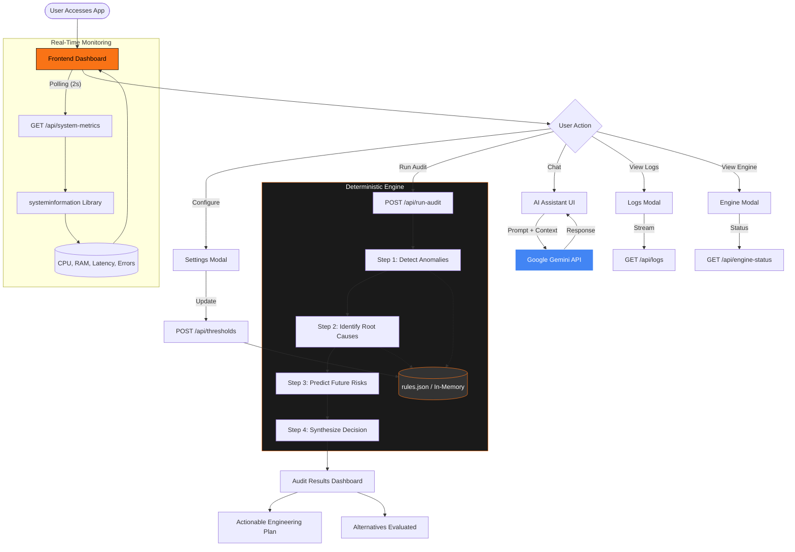

# 🧠 SysScope AI — Predict. Diagnose. Decide.

SysScope AI is an intelligent system monitoring and decision-support platform that goes beyond traditional dashboards.

Instead of just displaying metrics, SysScope AI:

* 🔮 Predicts failures before they occur
* 🧩 Identifies root causes using deterministic logic
* 🧠 Generates actionable engineering decisions in real time

---

## 🚀 Overview

Modern monitoring tools stop at visualization. SysScope AI introduces a **deterministic decision engine** that transforms raw system data into **clear, explainable, and actionable insights**.

It combines:

* Real-time system monitoring
* Rule-based anomaly detection
* Predictive analysis
* AI-assisted reasoning

---

## 🏗️ System Architecture

This Mermaid flowchart illustrates the high-level architecture and deterministic decision logic of SysScope AI:



---

## ⚙️ Key Components Explained

### 🔄 Real-Time Monitoring

* Frontend polls backend every **2 seconds**
* Collects:

  * CPU usage
  * RAM usage
  * Latency
  * Error rates
* Powered by `systeminformation` library

---

### 🧠 Deterministic Decision Engine

Unlike generic monitoring tools, SysScope AI runs a structured pipeline:

1. **Detect Anomalies**
   Compare live metrics against thresholds

2. **Identify Root Causes**
   Map anomalies to known failure patterns

3. **Predict Future Risks**
   Forecast potential system degradation

4. **Synthesize Decision**
   Generate a final actionable outcome

👉 This ensures **consistent, explainable, and reliable decisions**

---

### 🛠️ Actionable Engineering Output

Instead of raw data, the system provides:

* ✅ **Action Plan** (what to do)
* 🔄 **Alternative Solutions** (what else can be done)
* 📊 **Audit Results Dashboard**

---

### 🤖 AI Assistant (Context-Aware)

* Integrated AI chat interface
* Uses system state as context
* Can answer:

  * “Why is latency high?”
  * “What should I fix first?”

Powered by Google Gemini API.

---

### 📜 Rules Engine

* Stored in `rules.json` or in-memory
* Defines:

  * Thresholds
  * System behavior logic
* User-configurable via UI

---

## 🧪 Features

* ⚡ Real-time system monitoring
* 🧠 Deterministic decision engine
* 🔍 Root cause analysis
* 🔮 Predictive insights
* 🤖 AI-powered assistant
* 📊 Interactive dashboard
* ⚙️ Customizable thresholds

---

## 🛠️ Tech Stack

* **Frontend:** Vite + TypeScript
* **Backend:** Node.js + Express
* **System Metrics:** systeminformation
* **AI Integration:** Gemini API
* **Config Engine:** JSON-based rules

---

## 🔐 Environment Setup

Create a `.env` file based on:

```
.env.example
```

Example:

```
GEMINI_API_KEY=your_api_key
PORT=3000
```

---

## 🚀 Getting Started

```bash
# Install dependencies
npm install

# Run development server
npm run dev
```

---

## 🎯 Why SysScope AI Stands Out

Most tools:

* Show dashboards
* Trigger alerts

SysScope AI:

* **Explains problems**
* **Predicts failures**
* **Recommends decisions**

👉 It’s not a monitoring tool. It’s a **decision system**.

---

## 📄 License

MIT License
